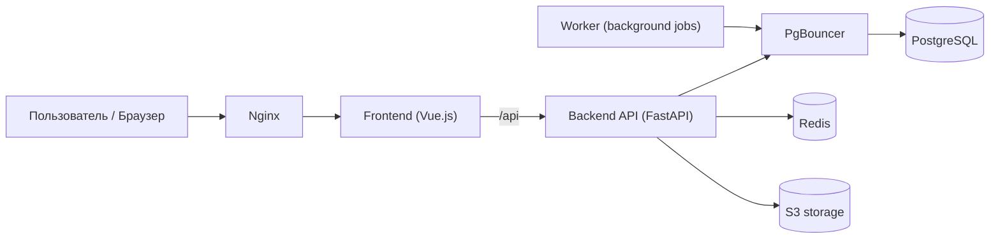

# Booking

Booking — сервис бронирования переговорных комнат: пользователи ищут свободные комнаты, создают/переносят брони, а система ведёт историю и отправляет уведомления.

## Архитектура (кратко)



Примечание: в production `Frontend (Vue.js)` не работает как отдельный runtime-сервис.  
Vue собирается в статические файлы (`dist`), и Nginx отдаёт их из того же контейнера.

Что где лежит:

- `frontend/vue-app/` — SPA на Vue 3.
- `backend/src/api` — HTTP-слой (роуты/schemas/dependencies).
- `backend/src/usecases` — бизнес-операции приложения.
- `backend/src/domain` — доменные сущности и правила.
- `backend/src/infra` — БД, кеш, интеграции (S3/email и т.д.).
- `backend/src/worker` — фоновые задачи (напоминания, обработка dispatch, автозавершение броней).

## Переменные окружения

В проекте используются разные `.env` для разных запусков:

- Корневой `/.env` — для `docker-compose.yml` (в первую очередь `POSTGRES_*` для контейнеров PostgreSQL/PgBouncer).
- `backend/.env.prod` — переменные backend и worker при запуске через корневой `docker-compose.yml`.
- `backend/.env.dev` — переменные для локальной backend-разработки через `backend/compose.yaml`.
- `backend/.env.example` — шаблон, от которого удобно отталкиваться.

Минимум, который обычно нужно проверить/подставить:

- `POSTGRES_DB`, `POSTGRES_USER`, `POSTGRES_PASSWORD` в `/.env`.
- `PG_RW_HOST`, `PG_RO_HOST`, `PG_DB`, `PG_USER`, `PG_PASS`, `PG_PORT`
  в backend env-файле. При необходимости для RO можно отдельно задать
  `PG_RO_PORT`, `PG_RO_DB`, `PG_RO_USER`, `PG_RO_PASS` (аналогично для RW).
- `JWT_ACCESS_SECRET`.
- S3/SMTP параметры, если нужны загрузка файлов и email-уведомления.

## Запуск

### Вариант 1: весь проект (рекомендуется)

Из корня проекта:

```bash
docker compose up --build
```

Что поднимется: `postgres`, `pgbouncer`, `redis`, `backend`, `worker`,
`otel-collector`, `tempo`, `prometheus`, `loki`, `grafana`, `nginx`.

Доступ:

- Приложение: `http://localhost:8080`
- Grafana: `http://localhost:3000`
- API внутри compose-сети ходит как `backend:8000` (наружу идём через `nginx`)

### Вариант 2: только backend-окружение для разработки API

Из директории `backend/`:

```bash
docker compose -f compose.yaml up --build
```

В этом режиме backend доступен на `http://localhost:8000`.

### Вариант 3: Kubernetes

Манифесты рассчитаны на кластер с `IngressClass=traefik`, StorageClass по
умолчанию для PVC и доступ к образам из Docker Hub. Перед запуском
проверьте контекст и инфраструктуру кластера:

```bash
kubectl config current-context
kubectl get ingressclass
kubectl get storageclass
```

Соберите образы из корня репозитория:

```bash
docker build -t booking-backend:1.0.0 backend
docker build -t booking-frontend:1.0.0 frontend/vue-app
```

Образы должны быть доступны на всех узлах кластера. Для локального
кластера загрузите их в container runtime кластера. Для удалённого —
отправьте в registry и замените `image` в `k8s/backend/deployment.yaml`,
`k8s/backend/worker.yaml`, `k8s/backend/migration-job.yaml` и
`k8s/frontend/deployment.yaml`.

Создайте локальный файл секретов и заполните все значения. Файл
`k8s/.secrets.env` игнорируется Git:

```bash
cp k8s/.secrets.env.example k8s/.secrets.env
```

Разверните namespace, конфигурацию и секреты:

```bash
kubectl apply -f k8s/namespace.yaml
kubectl apply -f k8s/configmap.yaml
kubectl create secret generic booking-secrets \
  --namespace booking \
  --from-env-file=k8s/.secrets.env \
  --dry-run=client -o yaml | kubectl apply -f -
```

Затем запустите инфраструктуру и дождитесь её готовности:

```bash
kubectl apply -f k8s/network-policy.yaml
kubectl apply -f k8s/postgres/
kubectl apply -f k8s/pgbouncer/
kubectl apply -f k8s/redis/
kubectl apply -f k8s/minio/pvc.yaml
kubectl apply -f k8s/minio/deployment.yaml
kubectl apply -f k8s/minio/service.yaml
kubectl apply -f k8s/minio/network-policy.yaml

kubectl wait --namespace booking --for=condition=available \
  deployment/postgres deployment/pgbouncer deployment/redis deployment/minio \
  --timeout=300s

kubectl apply -f k8s/minio/create-bucket-job.yaml
kubectl wait --namespace booking --for=condition=complete \
  job/minio-create-bucket --timeout=180s

kubectl apply -k k8s/observability
kubectl wait --namespace booking --for=condition=available \
  deployment/otel-collector deployment/tempo deployment/prometheus \
  deployment/loki deployment/grafana --timeout=300s
```

Примените миграции, после их завершения запустите backend, worker,
frontend и ingress:

```bash
kubectl apply -f k8s/backend/network-policy.yaml
kubectl apply -f k8s/backend/migration-job.yaml
kubectl wait --namespace booking --for=condition=complete \
  job/backend-migrations --timeout=300s

kubectl apply -f k8s/backend/deployment.yaml
kubectl apply -f k8s/backend/worker.yaml
kubectl apply -f k8s/backend/service.yaml
kubectl apply -f k8s/frontend/
kubectl apply -f k8s/ingress.yaml
kubectl wait --namespace booking --for=condition=available \
  deployment/backend deployment/worker deployment/frontend --timeout=300s
```

Проверьте состояние:

```bash
kubectl get pods,jobs,ingress -n booking
```

Приложение доступно по адресу `http://booking.localhost`, Grafana —
`http://grafana.booking.localhost`, S3 API — `http://s3.booking.localhost`.
Если ingress не публикуется на localhost, добавьте его адрес для трёх имён
в `/etc/hosts`.

Если HTTP-запрос всё равно перенаправляется на HTTPS, redirect настроен глобально
на entrypoint `web` самого Traefik. Его нужно отключить в конфигурации локальной
установки Traefik; одного изменения Ingress в таком случае недостаточно.

Для диагностики:

```bash
kubectl get events -n booking --sort-by=.lastTimestamp
kubectl logs -n booking deployment/backend --tail=200
kubectl logs -n booking job/backend-migrations
```

## Observability

Backend и worker отправляют traces, metrics и logs по OTLP/gRPC в
OpenTelemetry Collector. Collector маршрутизирует сигналы в Tempo, Prometheus и
Loki; datasource'ы автоматически подключаются в Grafana. Конфигурация и
retention описаны в [docs/observability.md](docs/observability.md).
