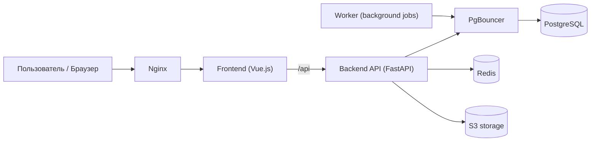

# Booking

Booking — сервис бронирования переговорных комнат: пользователи ищут свободные комнаты, создают/переносят брони, а система ведёт историю и отправляет уведомления.

## Архитектура (кратко)



Примечание: в production `Frontend (Vue.js)` не работает как отдельный runtime-сервис.  
Vue собирается в статические файлы (`dist`), и Nginx отдаёт их из того же контейнера.

Что где лежит:

- `frontend/vue-app/` — SPA на Vue 3.
- `backend/src/api` — HTTP-слой (роуты/schemas/dependencies).
- `backend/src/usecases` — бизнес-операции приложения.
- `backend/src/domain` — доменные сущности и правила.
- `backend/src/infra` — БД, кеш, интеграции (S3/email и т.д.).
- `backend/src/worker` — фоновые задачи (напоминания, обработка dispatch, автозавершение броней).

## Переменные окружения

В проекте используются разные `.env` для разных запусков:

- Корневой `/.env` — для `docker-compose.yml` (в первую очередь `POSTGRES_*` для контейнеров PostgreSQL/PgBouncer).
- `backend/.env.prod` — переменные backend и worker при запуске через корневой `docker-compose.yml`.
- `backend/.env.dev` — переменные для локальной backend-разработки через `backend/compose.yaml`.
- `backend/.env.example` — шаблон, от которого удобно отталкиваться.

Минимум, который обычно нужно проверить/подставить:

- `POSTGRES_DB`, `POSTGRES_USER`, `POSTGRES_PASSWORD` в `/.env`.
- `PG_HOST`, `PG_DB`, `PG_USER`, `PG_PASS`, `PG_PORT` в backend env-файле.
- `JWT_ACCESS_SECRET`.
- S3/SMTP параметры, если нужны загрузка файлов и email-уведомления.

## Запуск

### Вариант 1: весь проект (рекомендуется)

Из корня проекта:

```bash
docker compose up --build
```

Что поднимется: `postgres`, `pgbouncer`, `redis`, `backend`, `worker`, `nginx`.

Доступ:

- Приложение: `http://localhost:8080`
- API внутри compose-сети ходит как `backend:8000` (наружу идём через `nginx`)

### Вариант 2: только backend-окружение для разработки API

Из директории `backend/`:

```bash
docker compose -f compose.yaml up --build
```

В этом режиме backend доступен на `http://localhost:8000`.
